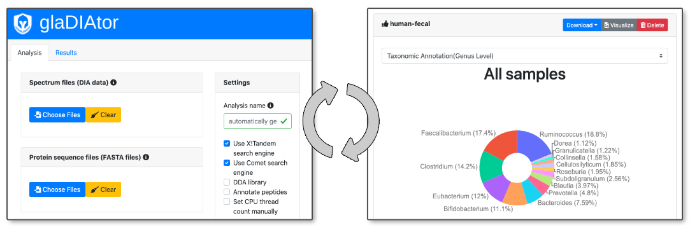

# glaDIAtor

<p align="center"> 

</p>


## Description

glaDIAtor is a software package for analyzing mass spectrometry data acquired using *data independent acquisition* (DIA) mode. It enables untargeted analysis of DIA proteomics and metaproteomics data without the need for any DDA data. The glaDIAtor software runs on x86/64 platforms supported by Docker. Having at least 128 GB RAM is recommended for running the example dataset presented in this Documentation.

## Installation

glaDIAtor is designed to run under container technologies such as Docker and Podman. Container technologies enable running glaDIAtor under multiple platforms (x64). These instructions are written for Linux operating system, which we recommend for running glaDIAtor.

The following folders are required:
1) A folder for input files such as raw data and sequence database files (/data here).
2) A folder for storing analysis results and intermediate files (/run-files here)

First, download glaDIAtor container from Docker Hub.

```
$ docker pull elolab/gladiator
```

### Start glaDIAtor

Then, deploy glaDIAtor in server mode and expose input files and result store location to the container:

```
“docker run --name gladiator --rm -d --network="host" -v /data:/data -v /run-files:/run-files gladiator pserve /opt/gladiator/UI/server.ini”
```
Note: Single workstation deployment is done by switching from server.ini to workstation.ini. Furthermore,--network="host" parameter is omitted. When running container as normal user (supported by Podman container technology), the listening port should be exported to high range with -p 8080:80. 

### Access glaDIAtor

After the container is deployed the glaDIAtor can be accessed by typing the server machine name to web browser. On workstation deployments, glaDIAtor can be accessed by typing http://localhost (or http://localhost:8080) to web browser address bar. The difference between server and workstation deployments is that workstation deployment is that with workstation deployment the GUI can only be accessed from the machine running glaDIAtor.

### Stop glaDIAtor

The glaDIAtor can be stopped with “docker stop gladiator” command.

## Analysis workflow

1. Choose DIA spectrum files to be analyzed.
    * Open format (mzXML, mzML) are supported, as well as Thermo Fisher Scientific raw files. Conversion from proprietary format is instructed in the published protocol (https://doi.org/10.1007/978-1-4939-8814-3_27).
2. Choose sequence database files (FASTA-files)
    * The files should contain the proteins of interest, the indexed retention time (iRT) peptides for normalization, peptides related to lysis, the digestion enzyme (typically trypsin), and if desired, possible contaminants.
3. Optional: Choose DDA files to build a spectral library.
    * Otherwise, glaDIAto builds a pseudospectral library directly from DIA samples. This requires enabling "DDA library" option.
4. Customize search parameters such as Precursor and Fragment tolerances.
5. Optional: Annotate the identified peptides:
    * Peptides can be annotated by enabling the annotation option from the settings panel on the right. In this case, an annotation table file in TSV-format is required that contains an ID column matching to FASTA identification and multiple annotation columns such as KEGG functional group.    
6. Choose a name for the analysis and start the analysis run.

## Analysis Results
Once the analysis has completed successfully, the analysis results are available on the results tab. The result files contain the identified peptides and proteins and their intensities in each sample. Also if annotation was enabled, corresponding annotation file is created. In addition, a quick overview of the results can be seen from the barplots of annotated peptides.

If glaDIAtor detects interrupted analysis run, an option is provided where analysis run can be continue. Furthermore, there is an option to load settings from an existing run. This sets the analysis view settings according to those of an existing run. 

## APPENDIX

### Example dataset

A test run of glaDIAtor can be performed by downloading a metaproteomic human fecal dataset from DIA sample files from ProteomeXchange Consortium, PRIDE repository (https://www.ebi.ac.uk/pride/) identifier PXD008738.

* 170825_HF_1ug_DIA_1column_1.raw
* 170825_HF_1ug_DIA_1column_2.raw
* 170825_HF_1ug_DIA_1column_3.raw
* 170825_HF_1ug_DIA_1column_4.raw
* 170825_HF_1ug_DIA_1column_5.raw
* 170825_HF_1ug_DIA_1column_6.raw

### Microbiota protein database

https://db.cngb.org/microbiome/genecatalog/genecatalog_human/


### Convert the raw mass spectrometry files to open format

The conversion needs to be done on a Windows platform using the ProteoWizard software. 

Convert the DIA raw files to mzML format using the MSConvert program from the ProteoWizard software with the following options:

* Output format: mzML
* Extension: empty
* Binary encoding precision: 64bit
* Write index: checked
* TPP compatibility: checked
* Use zlib compression: unchecked
* Package in gzip: unchecked
* Use numpress linear compression: unchecked
* Use numpress short logged float compression: unchecked
* Use numpress short positive integer compression: unchecked
* Only titleMaker filter

Note, if you have Thermo Fisher Scientific instrument, glaDIAtor is able to read its raw files and this step is not needed. However, glaDIAtor does not distribute the needed conversion library, but instead downloads the library online when glaDIAtor is run first time.

### How to customize peptide search parameters of the spectral/pseudospectral library

The default parameters are for a nanoflow HPLC system (Easy-nLC1200, Thermo Fisher Scientific) coupled to a Q Exactive HF mass spectrometer (Thermo Fisher Scientific) equipped with a nano-electrospray ionization source.

Below is the summary of the default settings:

* Precursor mass tolerance: 10 ppm
* Fragment ion tolerance: 0.02 Da
* Cleavage site: Trypsin_P
* Fixed modification: Carbamidomethyl (C)
* Variable modification: Oxidation (M)

glaDIAtor UI provides a small set of search parameter settings that can be adjusted. If more settings needs to be adjusted, the default settings (comet_settings_template.xml and xtandem_settings_template.xml) can be accessed at the container image location /opt/gladiator/. 

### Run the analysis from the command line


Get help of all command line parameters:
```
$ docker run --rm gladiator /opt/gladiator/gladiator.py --help
```

Example:

```
$ docker run -it --rm \
-u $(id -u):$(id -g) \
-v /files/data/:/data \
-v /files/out:/run-files \
gladiator /opt/gladiator/gladiator.py \
--project-name my-first-analysis \
--sample-data /data/fecal/DIA/mzML/170825_HF_1ug_DIA_1column_1.raw /data/fecal/DIA/mzML/170825_HF_1ug_DIA_1column_2.raw /data/fecal/DIA/mzML/170825_HF_1ug_DIA_1column_3.raw /data/fecal/DIA/mzML/170825_HF_1ug_DIA_1column_4.raw /data/fecal/DIA/mzML/170825_HF_1ug_DIA_1column_5.raw /data/fecal/DIA/mzML/170825_HF_1ug_DIA_1column_6.raw \
--databases /data/ref/IGC.pep.fasta /data/ref/irtfusion.fasta /data/ref/uniprot_human.fasta /data/ref/trypsin.fasta /data/ref/Q7M135.fasta
```

After the processing has completed, the "out" folder contains `dia-peptide-matrix.tsv` and `dia-protein-matrix.tsv` files. The files are TSV formatted and can be loaded to spreadsheet programs like MS Excel or to a statistical analysis program like R. The `dia-peptide-matrix.tsv` contains the detected peptides and their intensity for each of the samples. The first column contains the peptide sequence and a list of possible source proteins. The rest of the columns indicate the samples and contain the peptide intensity values in each sample. Similarly, `dia-protein-matrix.tsv` contains the intensity values at the protein level. \
\
To perform an optional differential expression analysis between the sample groups, the groups must be provided using an additional parameter in the command: --design-file <designFilename>. The design file must be defined as a tab-separated file (see `example-design-file.tsv`), where the column Filename refers to the filename of a sample, the column Condition is the group to which the sample belongs, the column BioReplicate refers to the biological replicate, and the column Run to the MS run.

### Annotate the peptide intensity matrix from command line

```
$ docker run -it --rm \
-u $(id -u):$(id -g) \
-v /files/data/:/data \
-v /files/results:/run-files \
gladiator /opt/gladiator/annotate-matrix.py \
--project-name my-first-analysis \
--annotation-files /data/ref/IGC.annotation.summary.v2-with-header.tsv \
--id-column 'Gene Name'
```
There are two optional parameters
* --threshold (The number of different annotations after which a peptide is labeled ambiguous. Default is 2.)
* --merge-unimods (Merge modifications by summing the intensities of peptides with the same amino acid sequence. Peptide sequences become unique.)

Note, the IGC annotation file IGC.annotation.summary.v2.tsv file, available at IGC homepage, is missing the column headers and the headers are needed to be added to the annotation file (IGC.annotation.summary.v2-with-header.tsv) before using the file in glaDIAtor. The list of column headers are listed below:

* Gene ID
* Gene Name
* Gene Length
* Gene Completeness Status
* Cohort Origin
* Taxonomic Annotation(Phylum Level)
* Taxonomic Annotation(Genus Level)
* KEGG Annotation
* eggNOG Annotation
* Sample Occurence Frequency
* Individual Occurence Frequency
* KEGG Functional Categories
* eggNOG Functional Categories
* Cohort Assembled


### Use DDA data for the library

Download the following human fecal DDA sample files for library construction from ProteomeXchange Consortium, PRIDE repository (https://www.ebi.ac.uk/pride/) identifier PXD008738:

* 170825_HF_1_6_pool_2ug_DDA_library_1column_1.raw
* 170825_HF_1_6_pool_2ug_DDA_library_1column_2.raw
* 170825_HF_1_6_pool_2ug_DDA_library_1column_3.raw
* 170825_HF_1_6_pool_2ug_DDA_library_1column_4.raw
* 170825_HF_1_6_pool_2ug_DDA_library_1column_5.raw
* 170825_HF_1_6_pool_2ug_DDA_library_1column_6.raw

Convert the DDA raw files to mzXML format on a Windows platform using the ProteoWizard software.

```
FOR %i IN (*.raw) DO \
"\Program Files\ProteoWizard\ProteoWizard 3.0.11252\qtofpeakpicker.exe" \
--resolution=2000 \
--area=1 \
--threshold=1 \
--smoothwidth=1.1 \
--in %i \
--out %~ni.mzXML
```

DDA-files can be specified to the gladiator.py with --library-data.

Example:
```
--library-data /data/fecal/DDA/mzXML-peak-picked/170825_HF_1_6_pool_2ug_DDA_library_1column_1.raw \
/data/fecal/DDA/mzXML-peak-picked/170825_HF_1_6_pool_2ug_DDA_library_1column_2.raw \
/data/fecal/DDA/mzXML-peak-picked/170825_HF_1_6_pool_2ug_DDA_library_1column_3.raw \
/data/fecal/DDA/mzXML-peak-picked/170825_HF_1_6_pool_2ug_DDA_library_1column_4.raw \
/data/fecal/DDA/mzXML-peak-picked/170825_HF_1_6_pool_2ug_DDA_library_1column_5.raw \
/data/fecal/DDA/mzXML-peak-picked/170825_HF_1_6_pool_2ug_DDA_library_1column_6.raw 
```


### Build the glaDIAtor Docker image using the Dockerfile in this repository.

```
$ docker build -t glaDIAtor . -f Dockerfile
```


